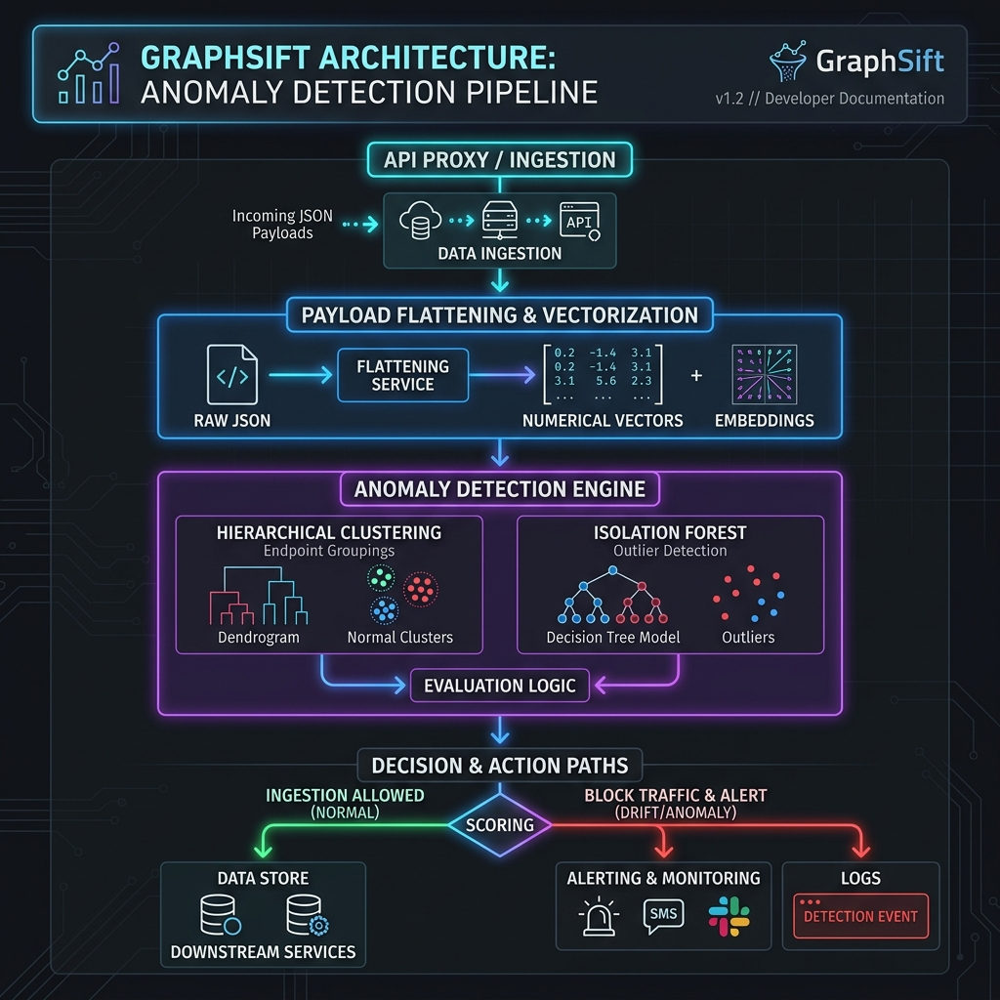

# GraphSift: API Payload Structure & Dependency Audit Engine

GraphSift is an interactive AI-driven API audit dashboard and security guardrail. It uses **unsupervised machine learning** to analyze arbitrary JSON payloads, cluster them into endpoint schemas, and flags real-time **structural drift alerts** to block corrupted or malicious payload injections.



---

## 🔬 Core Concept & Machine Learning Mandate

Microservices are constantly communicating. When a third-party API silently changes its schema or gets injected with malformed data types, standard static validation tools fail or crash.

### How it works
1. **The Ingestion**: Payloads are ingested via raw JSON structures.
2. **Feature Engineering**: Structures are flattened into numerical representations:
   - Key Count, Max Nesting Depth.
   - Type Ratios (Strings, Numerics, Booleans, Objects, Arrays, Nulls).
   - Value Metrics (Average String Length, String Length Variance, Average Array Size).
3. **Unsupervised Clustering**: Agglomerative Hierarchical Clustering (using Cosine or Euclidean linkage) groups structures into natural API endpoints.
4. **The Security Guardrail**: An unsupervised **Isolation Forest** learns normal boundaries. If a bloated, deeply-nested, or typed-mismatched payload comes in, it triggers a **Critical Structural Drift Alert** to block the traffic.

### ⚠️ The Data Quality Rule: "Garbage In, Garbage Out"
GraphSift includes a **Data Quality comparison sandbox** showing how training on noisy data (web crawlers scanning random URLs, database stack traces, heartbeats) compromises clustering boundaries. Filtering out noise yields clean schemas, a high Cophenetic Correlation Coefficient, and highly reliable drift detection.

---

## 🛠️ Step-by-Step Installation & Launch

GraphSift is packaged for local execution on Intel Macbooks using Docker Compose.

### Prerequisites
- [Docker Desktop](https://www.docker.com/products/docker-desktop/) (which includes Docker Compose) installed and running.

### 1. Build and Launch the Application
Navigate to the directory containing the code and run Docker Compose:
```bash
docker compose up --build
```
This builds the application image and spins up the Streamlit server in a single command.

### 2. Launch the Web Application
Open your web browser and navigate to:
```
http://localhost:8503
```

### 3. Stop the Application
To stop and clean up the running container, execute:
```bash
docker compose down
```

---

## 🧪 Testing the App: Normal and Anomaly Use Cases

GraphSift includes a live interactive sandbox to test payloads:

1. **Happy Path (Normal Schema)**:
   - Select **Happy Path: Payment Charge** or **Happy Path: User Profile** presets.
   - Click **Run Schema Audit Engine**.
   - The engine validates the payload, fits it into a cluster, and shows a green **"SCHEMA VERIFIED"** banner.

2. **Negative Edge Case: Schema Bloat (Payload Anomaly)**:
   - Select the **Anomaly: Schema Bloat** preset (injects 30+ randomized keys).
   - Click **Run Schema Audit Engine**.
   - The engine blocks the payload under **"CRITICAL STRUCTURAL DRIFT"** due to key count anomaly.

3. **Negative Edge Case: Nesting DOS Injection (Security Anomaly)**:
   - Select the **Anomaly: Deep Nesting DOS** preset (a payload nested 15 levels deep).
   - The Isolation Forest identifies this as an outlier and registers a **"CRITICAL STRUCTURAL DRIFT"** alert.

4. **Custom Payloads**:
   - Ingest custom JSON schemas by pasting directly into the text box and click **Run Schema Audit Engine**.

---

## ⚙️ Configuration & Model Tweaking

From the sidebar menu, you can configure the underlying model:
- **Clean Payload / Noisy Samples**: Increase or decrease samples to test scaling.
- **Linkage Method**: Choose between `Ward`, `Complete`, or `Average`.
- **Distance Metric**: Switch between `Euclidean`, `Cosine`, or `Cityblock` (Manhattan) metrics.
- **Target Clusters (k)**: Set the number of schemas expected.
- **Data Quality Filter**: Toggle between **Clean Training Data** (filtering out crawlers/errors) and **Raw / Noisy Training Data** to see the clustering boundary degrade.